<!-- Header Banner -->

 

<svg viewBox="0 0 900 180" xmlns="http://www.w3.org/2000/svg" width="100%">
  <defs>
    <linearGradient id="bg" x1="0%" y1="0%" x2="100%" y2="100%">
      <stop offset="0%" style="stop-color:#0f0c29"/>
      <stop offset="50%" style="stop-color:#302b63"/>
      <stop offset="100%" style="stop-color:#24243e"/>
    </linearGradient>
    <linearGradient id="wave1" x1="0%" y1="0%" x2="100%" y2="0%">
      <stop offset="0%" style="stop-color:#00FFD1;stop-opacity:0.4"/>
      <stop offset="100%" style="stop-color:#7c3aed;stop-opacity:0.4"/>
    </linearGradient>
  </defs>
  <rect width="900" height="180" fill="url(#bg)" rx="0"/>
  <path d="M0,120 C150,80 300,160 450,110 C600,60 750,140 900,100 L900,180 L0,180 Z" fill="url(#wave1)" opacity="0.5"/>
  <path d="M0,140 C200,100 400,170 600,130 C750,100 850,150 900,130 L900,180 L0,180 Z" fill="#7c3aed" opacity="0.2"/>
  <circle cx="60" cy="40" r="3" fill="#00FFD1" opacity="0.6"/>
  <circle cx="840" cy="40" r="3" fill="#00FFD1" opacity="0.6"/>
  <circle cx="820" cy="60" r="2" fill="#7c3aed" opacity="0.8"/>
  <circle cx="80" cy="65" r="2" fill="#7c3aed" opacity="0.8"/>
  <text x="450" y="75" font-family="monospace" font-size="36" font-weight="bold" fill="#ffffff" text-anchor="middle" letter-spacing="2">Prasanna Kumar J M</text>
  <text x="450" y="108" font-family="monospace" font-size="13" fill="#a8b2d8" text-anchor="middle" letter-spacing="1">Full Stack Developer · AI &amp; BCI Researcher · Cloud Explorer</text>
  <line x1="280" y1="118" x2="620" y2="118" stroke="#00FFD1" stroke-width="1.5" opacity="0.5"/>
</svg>

 

  

---
<picture>
  <source media="(prefers-color-scheme: dark)" srcset="dark.svg">
  <source media="(prefers-color-scheme: light)" srcset="light.svg">
  
</picture>

&nbsp;

&nbsp;

&nbsp;

&nbsp;

## 🛠️ Tech Stack

### 🎨 Frontend

### ⚙️ Backend

### 🗄️ Databases

### 💻 Languages

### ☁️ Cloud & Tools

---

## 🚀 Featured Projects

<table>
<tr>
<td width="50%" valign="top">

### 🧠 SSVEP Brain-Computer Interface

Real-time **EEG signal classification** using deep learning. Neural networks trained to interpret brainwaves for seamless brain-device interaction — from preprocessing to feature extraction to model optimization.

**Stack:** `Python` · `TensorFlow` · `Signal Processing` · `Neural Networks`

</td>
<td width="50%" valign="top">

### 👗 Ambika's Boutique

Full-stack e-commerce platform with a **virtual try-on** feature via live camera feed. Features secure JWT auth, product management, and a smooth responsive UI.

**Stack:** `MongoDB` · `Express` · `React` · `Node.js` · `JWT` · `REST API`

</td>
</tr>
<tr>
<td width="50%" valign="top">

### 🌾 AgriConnect — SIH 2025

Direct farmer-to-buyer marketplace — **zero middlemen**. Real-time interaction, transparent pricing, and digital empowerment for agricultural trade across India.

**Stack:** `MERN` · `Real-time Engine` · `Price Transparency` · `Auth`

</td>
<td width="50%" valign="top">

### 📋 Scheme Seva

**AI-powered** government scheme recommender for Indian citizens. Intelligent eligibility-based filtering connects users to the most relevant schemes instantly.

**Stack:** `MERN` · `AI/ML` · `Dynamic Fetching` · `Auth`

</td>
</tr>
<tr>
<td colspan="2">

### ⛽ Online Fuel Delivery App — POC 2023

Location-based fuel ordering platform with **real-time GPS tracking**, secure payments, and a complete delivery management dashboard. Presented as official Proof of Concept.

**Stack:** `Full Stack` · `Maps API` · `Payment Gateway` · `Order Management`

</td>
</tr>
</table>

---

## 🏅 Certifications

| Certification | Issuer | Focus Areas |
|:---|:---:|:---|
| ✅ **Java SE 17 Professional** | Oracle | OOP · Exception Handling · Modern Java |
| ✅ **Oracle APEX Developer** | Oracle | Low-Code · DB Applications · UI Design |
| ✅ **OCI Generative AI Professional** | Oracle | Prompt Engineering · OCI · Gen AI Pipelines |

---

## 🏆 Achievements

| Achievement | Result | Event |
|:---|:---:|:---:|
| 🎨 UI/UX Design Competition | 🥇 **1st Prize** | Quantum Fest |
| 💡 Project Presentation | 🥈 **2nd Prize** | Spring Fest |
| 🎬 Video & Poster Editing | 🥈 **2nd Prize** | Quantum Fest |
| ⭐ Best Student — AWS Training | 🌟 **Special Award** | Genuine |
| 🔥 Online Fuel Delivery POC | 🎤 **Presenter** | POC 2023 |
| 🤖 n8n Team Workflow Management | 📊 **Presenter** | Hackwave 3.0 |
| 💻 Hackathon Participation | 🤝 **Participant** | Hackwave 2.0 |

---

## 📊 GitHub Analytics

<table>
  <tr>
    <td>
      
    </td>
    <td>
      
    </td>
  </tr>
</table>

 

 

 

<picture>
  <source media="(prefers-color-scheme: dark)" srcset="https://raw.githubusercontent.com/platane/platane/output/github-contribution-grid-snake-dark.svg"/>
  <source media="(prefers-color-scheme: light)" srcset="https://raw.githubusercontent.com/platane/platane/output/github-contribution-grid-snake.svg"/>
  
</picture>

 

---

## 🎯 Interests

---

## 📬 Let's Connect

I'm open to **internships**, **collaborations**, and **cool side projects** — remote or on-site!

 

&nbsp;

 

&nbsp;

&nbsp;

  

---

<svg viewBox="0 0 900 100" xmlns="http://www.w3.org/2000/svg" width="100%">
  <defs>
    <linearGradient id="footerbg" x1="0%" y1="0%" x2="100%" y2="100%">
      <stop offset="0%" style="stop-color:#24243e"/>
      <stop offset="50%" style="stop-color:#302b63"/>
      <stop offset="100%" style="stop-color:#0f0c29"/>
    </linearGradient>
  </defs>
  <rect width="900" height="100" fill="url(#footerbg)"/>
  <path d="M0,40 C150,80 300,10 450,50 C600,90 750,20 900,55 L900,0 L0,0 Z" fill="#00FFD1" opacity="0.08"/>
  <path d="M0,20 C200,60 400,5 600,40 C750,65 850,25 900,35 L900,0 L0,0 Z" fill="#7c3aed" opacity="0.12"/>
</svg>

**✨ "Code is poetry, and every bug is just a plot twist." ✨**

 

&nbsp;

 

⭐ **If this profile inspires you, drop a star!** ⭐

